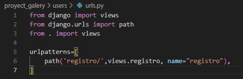

<table>
    <theader>
        <tr>
            <td></td>
            <th>
                UNIVERSIDAD NACIONAL DE SAN AGUSTIN 
                FACULTAD DE INGENIERÍA DE PRODUCCIÓN Y SERVICIOS 
                DEPARTAMENTO ACADÉMICO DE INGENIERÍA DE SISTEMAS E INFORMÁTICA 
                ESCUELA PROFESIONAL DE INGENIERÍA DE SISTEMAS
            </th>
            <td></td>
        </tr>
    </theader>
    <tbody>
        <tr><td colspan="3">Formato: Informe de Práctica de Laboratorio</td></tr>
        <tr><td>Aprobación:  2022/03/01</td><td>Código: GUIA-PRLD-001</td><td>Página: 1</td></tr>
    </tbody>
</table>

INFORME DE LABORATORIO 

<table>
<theader>
<tr><th colspan="6">INFORMACIÓN BÁSICA</th></tr>
</theader>
<tbody>
<tr><td>ASIGNATURA:</td><td colspan="5">Programación Web 2</td></tr>
<tr><td>TÍTULO DE LA PRÁCTICA:</td><td colspan="5">Django</td></tr>
<tr>
<td>NÚMERO DE PRÁCTICA:</td><td>05</td><td>AÑO LECTIVO:</td><td>2023-A</td><td>NRO. SEMESTRE:</td><td>III</td>
</tr>
<tr>
<td>FECHA INICIO::</td><td>05-Jun-2023</td><td>FECHA FIN:</td><td>12-Jun-2023</td><td>DURACIÓN:</td><td>04 horas</td>
</tr>
<tr><td colspan="6">RECURSOS:
    <ul>
        <li><a href="https://git-scm.com/book/es/v2">https://git-scm.com/book/es/v2</a></li>
        <li><a href="https://guides.github.com/">https://guides.github.com/</a></li>        
        <li><a href="https://www.w3schools.com/java/default.asp">https://www.w3schools.com/java/default.asp</a></li>
    </ul>
</td>
</<tr>
<tr><td colspan="6">DOCENTE:
<ul>
<li>Anibal Sardon </li>
</ul>
</td>
</<tr>
<tr><td colspan="6">INTEGRANTES:
<ul>
<li>Joshep Antony Ccahuana Larota - jccahuanala@unsa.edu.pe </li>
</ul>
<ul>
<li>Pedro Luis Christian Zapana Romero - pzapanar@unsa.edu.pe </li>
</ul>
</td>
</<tr>
</tdbody>
</table>

# Django

 1. Competencias del curso
 
 • General: C.c. Diseña responsablemente aplicaciones web, sus
 componentes o procesos para satisfacer necesidades dentro de
 restricciones realistas: económicas, medio ambientales, so- ciales,
 políticas, éticas, de salud, de seguridad, manufacturación y
 sostenibilidad.

 • Específica: C.m. Construye responsablemente soluciones con
 tecnología web siguiendo un proceso adecuado llevando a cabo las
 pruebas ajustada a los recursos disponibles del cliente.• Específica:
 C.p. Aplica de forma flexible técnicas, métodos, principios, normas,
 estándares y herramientas del desarrollo web necesarias para la
 construcción de aplicaciones web e implementación de estos sistemas en
 una organización.

 2. Resultado del estudiante
 
 • RE. 2 La capacidad de aplicar diseño de ingeniería para producir
 soluciones a problemas y disenar sistemas, componentes o procesos para
 satisfacer necesidades específicas dentro de consideraciones realistas
 en los aspectos de salud pública, seguridad y bienestar; factores
 globales, culturales, sociales, económicos y ambientales.

 • RE. 8 La capacidad de crear, seleccionar y utilizar técnicas,
 habilidades, recursos y herra-mientas modernas de ingeniería y
 tecnologías de la información, incluyendo la predicción y el
 modelamiento, con una comprensión de las limitaciones.

 3. Equipos, materiales y temas
 
 • Sistema Operativo (GNU/Linux de preferencia).
 • GNU Vim.
 • Python 3.
 • Git.
 • Cuenta en GitHub con el correo institucional.
 • Entorno virtual.
 • Django 4.
 
 4. Directorio de trabajo

 • Cree su directorio de trabajo.

 • Luego, diríjase a este directorio, para clonar su repositorio y
 continuar sus practicas.• Siempre evalue utilizar un archivo
 .gitignore para no considerar algunos archivo innecesarios sobre todo
 para el repositorio GitHub.
 
 • Pueden haber varios de estos archivos, ubicados estratégicamente,
 por ejemplo sólo para un laboratorio particular.

 • Estudie el archivo .gitignore del proyecto Library:\ https://github.com/mdn/django-locallibrary-tutorial/blob/main/.gitignore

 5. Marco teórico

    1\. Django
     
    • Django es un framework web Python con el cuál el desarrollo de sitios web son rápidos, seguros y sobre todo fáciles de 
    mantener.
     
    • Django se ocupa de gran parte de las molestias del desarrollo web, por lo que puede concentrarse en escribir su aplicación 
    sin necesidad de reinventar la rueda.
     
    • Es software libre, tiene una comunidad próspera y activa, excelente documentación y muchas opciones de soporte gratuito y 
    de pago.

    2\. Crear un directorio para el entorno virtual de Django
     
    • Para crear un ambiente elija en qué directorio se va crear el entorno virtual.

    3\. Crear entorno virtual en un directorio
     
    • En este directorio crear un entorno virtual ejecutando el siguiente comando: \$ virtualenv -p python3 .

    4\. Activando entorno virtual
     
    • En el directorio de trabajo active el entorno virtual ejecutando el
    script activate. 
     
    • Sea cual sea nuestro sistema operativo sabremos que el entorno virtual se ha activado porque su nombre aparece entre
    paréntesis delante del promt.
    
    5\. Desactivando entorno virtual
     
    • El comando para desactivar el entorno virtual es idéntico para
    Windows, macOS y Linux: \$deactivate\
     
    6. Instalando Django dentro del entorno virtual
     
    • Siempre hay que estar consientes de los paquetes de nuestro entorno
     virtual.
    
    • Instalamos Django con pip: \$ pip install Django\
     
    • Volvemos a listar los paquetes instalados: \$ pip list\
     
 6. Ejercicios
    
• Cree la aplicación Library paso a paso desde la siguiente url:\ https://developer.mozilla.org/en-US/docs/Learn/Server-side/Django/Tutorial_local_library_website\
 
 7. Tarea
    
 • Elabore un primer informe grupal de la aplicación que desarrollará
 durante este semes- tre.

 • Utilicen todas las recomendaciones dadas en la aplicación library.
 • Acuerdos :
 **--** - Los grupos pueden estar conformado por 1 a 4 integrantes.

 **--** - Sólo se presenta un informe grupal.

 **--** - Sólo se revisa un repositorio. (El único que esté en el informe grupal).

 **--** - Todos los integrantes del grupo tienen una copia del laboratorio e informe en su repositorio privado.

 **--** - Todos los integrantes deben pertenecer al mismo grupo de laboratorio.

 **--** - El docente preguntará en cualquier momento a un integrante sobre el proyecto, codigo fuente, avance.

 \(a\) Backend

 **Urls.py-Proyecto**
 
 Los path se encargan de incluir los archivos url de las aplicaciones.

 
 
 **Urls.py-App_galery y Users**
 
 En este apartado son importados las vistas que se encuentran ubicadas
 en los ar-chivos views.py.

 

 

 **Views.py-App_galery y Users**
 
 Aqui se encuentran los metodos que envian y reciben las solicitudes
 que sean nece-sarias en la pagiga web.

 

 

 \(b\) Frontend

 **base.html**
 
 Se encuentran la barra de navegacion que sera utilizada en todas las
 paginas html para navegar por la aplicacion.
 
 

 **Mostrar.html**
 
 Se incrusta esta pagina web en la base.html y por medio de un for se
 mestra los distintos articulos de la base de datos.

 
 
 **Form.html**
 
 Se incrusta esta pagina web en la base.html y busca agregar productos.

 

 **Login.html**
 
 Se incrusta esta pagina web en la base.html y al llenar el formulario
 se podra iden-tificar el usuario.

 
 
 **Registro.html**
 
 Se incrusta esta pagina web en la base.html y por medio del formulario
 se creara un nuevo usuario.

 

 **Ejecucion**

 

 

 

 

 

 8\. Pregunta

 • Por cada integrante del equipo, resalte un aprendizaje que adquirió al momento de estudiar Django. No se reprima de ser 
 detallista.Coloque su nombre entre parentesis para saber que es su aporte.

 • Opinión (Joshep): Me pareció que la manera de desarrollo y creación
 de la aplicación asi como el manejo de los diferentes módulos, fue
 bastante tediosa al inicio, por más documentación que se lea y
 tutoriales, me ha parecido difícil de asimilar, sin embargo me parece
 un framework bastante útil e importante de aprender. Por ello el
 aprendizaje que resaltaria sería el de seguir buscando información y
 practicar, y no rendirme.

 • Opinion (Pedro Luis): En mi opinion la herramienta de Django al
 utilizar el sistema modelo-vista-controlador hace mas intuitiva la
 manera de dasarrrollar una pagina web ademas de facilitar aplicacones
 por defecto que ayudan a comenzar los proyectos. El aprendizaje mas
 reasaltante de este framework para mi fue el poder crear templates y
 llamarlos por medio de las vistas las cuales pueden ser utilizadas
 como convalidadores en el caso de trabajar con usuarios.

 9\. Referencias

 • https://developer.mozilla.org/en-US/docs/Learn/Serverside/Django/Tutorial_local_library_website

 • https://github.com/mdn/django-locallibrary-tutorial

 • https://github.com/rescobedoq/pw2/tree/main/labs/lab05

 • William S. Vincent. (2022). Django for Beginners: Build websites with Python. Django 4.0. leanpub.com. \[URL\]

 • Repositorio Grupal: https://github.com/christian460/Lab5_Grupal.git

 • Repositorio Indvidual: (Pedro Luis) https://github.com/christian460/lab5/tree/front

 • Repositorio Indvidual: (Joshep) https://github.com/Joshep-c/PW2LAB.git

 • Codigo del informe en latex: https://www.overleaf.com/3418587543ysxvqrmqfpyh
